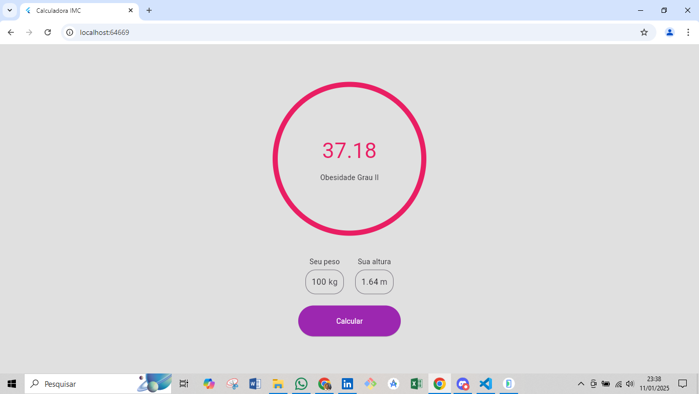

# Calculadora de IMC

Este é um aplicativo de calculadora de IMC (Índice de Massa Corporal) desenvolvido com Flutter. Ele permite aos usuários calcular seu IMC com base no peso e altura informados, e fornece uma classificação com base no valor calculado.

## Funcionalidades

- Inserir peso e altura
- Calcular o IMC
- Exibir classificação do IMC (abaixo do peso, normal, sobrepeso, obesidade)
- Exibir cor indicativa do resultado do IMC

## Screenshots




## Instalação

Para clonar e executar este aplicativo, você precisará do [Git](https://git-scm.com) e do [Flutter](https://flutter.dev/docs/get-started/install) instalados em seu computador.

```bash
# Clone este repositório
$ git clone https://github.com/leandrolns87/calculadora-imc

# Vá para o diretório do projeto
$ cd calculadora-imc

# Instale as dependências
$ flutter pub get

# Execute o aplicativo
$ flutter run

## Getting Started

Este projeto é um ponto de partida para um aplicativo Flutter.

Alguns recursos para ajudá-lo a começar, se este for seu primeiro projeto Flutter:

Laboratório: Escreva seu primeiro aplicativo Flutter

Cookbook: Exemplos úteis de Flutter

Para obter ajuda para começar com o desenvolvimento Flutter, veja a documentação online, que oferece tutoriais, exemplos, orientações sobre desenvolvimento móvel e uma referência completa da API.
